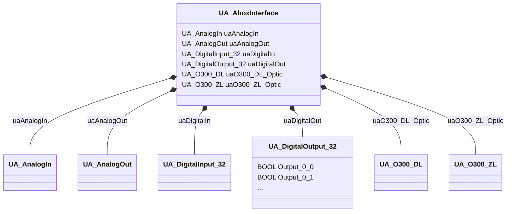
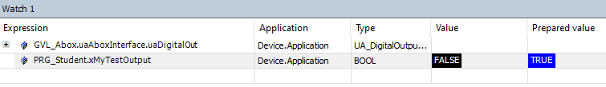
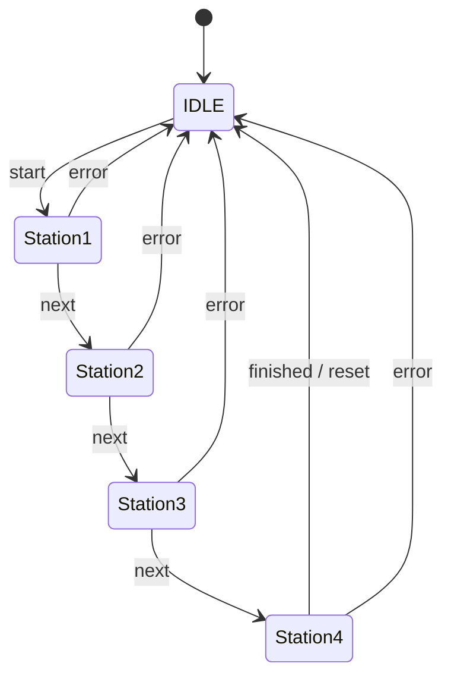

<h1 align="left">
  <br>
  
  <br>
  HEI-Vs Engineering School 
</h1>
  
<h2>   Automation in Development and Production </h2>
  <br>

Course DLS/ADP

Author: [Cédric Lenoir](mailto:cedric.lenoir@hevs.ch)

> Version 2026, V1.0


# LAB 01 Introduction to PLC
**PLC** for Programming Locic Controller.

## Table of contents

- [Objectives](#objectives)
- [Environment Overview](#environment-overview)
    - [CtrlX Core](#ctrlx-core)
    - [Software](#software)
        - [ctrlX WORKS](#ctrlx-works)
        - [HMI](#hmi)
    - [Node-Red](#node-red)
        - [Installing Node-Red](#installing-node-red)
- [Your First Program](#your-first-program)
    - [Implement the following program in the PLC](#implement-the-following-program-in-the-plc)
    - [Procedure](#procedure)
    - [Data Layer](#data-layer)
    - [Visualizing variables](#visualizing-variables)
    - [Linking variables to the hardware](#linking-variables-to-the-hardware)
    - [About STRUCT](#about-struct)
    - [About watch window](#about-watch-window)
    - [Your job](#your-job)
- [What is a Function Block](#what-is-a-function-block)
- [Programming a Rising Edge Detector](#programming-a-rising-edge-detector)
    - [Complete the PLC program with the code below](#complete-the-plc-program-with-the-code-below)
- [Programming a Timer](#programming-a-timer)
- [Use of state machine](#use-of-state-machine)
    - [Using ENUM](#using-enum)
    - [State Machine with CASE..OF](#state-machine-with-caseof)
- [What else?](#what-else)
- [Annexe](#annexe)
    - [PLC Tags, SDS, Software Design Specification](#plc-tags-sds-software-design-specification)
- [Information](#information)

*Annexe:*
-   [QuickStart_ctrlX_PLC to load and upload your first project from archive.](./QuickStart_ctrlX_PLC.md)


*Keywords:* **plc FUNCTION BLOCK CYCLIC TASK R_TRIG TON**

# Objectives
Understand the basic operating principles of a PLC.

To achieve these objectives, the following exercises will be carried out:

- Using a structure to read and write inputs/outputs
- Programming an edge detector
- Programming a timer
- Basic logic functions
- State machine
  
---

# Environment Overview
## CtrlX Core
The PLC program will be executed in the **ctrlX Core** available on each unit in the automation lab.

The **ctrlX Core** operates on a real-time Linux operating system embedded within an electrical axis controller (64-bit quad-core ARM processor).

<figure>
    
    <figcaption>CtrlX CORE Architecture drive based</figcaption>
</figure>

<br>


The "ctrlX Core" is an open architecture that allows the integration of various applications and services.

<figure>
    
    <figcaption>ctrlX CORE PLC Runtime Overview</figcaption>
</figure>

---

## Software

### ctrlX WORKS

CtrlX WORKS is a software suite developed by Bosch Rexroth for programming and managing **ctrlX Core** systems.

It allows the management of devices, whether real or virtual, connected to the development PC.

ctrlX WORKS includes an integrated development environment (IDE) for programming in the languages ​​described in the IEC 61131-3 standard, called **ctrlX PLC Engineering**.

> Version of CtrlX WORKS used at the time of writing: 3.6.3

Link to download ctrlX Works:
[Rexroth Store CtrlX Works](https://apps.boschrexroth.com/microsites/ctrlx-automation/en/portfolio/ctrlx-works/). For your information. It is not necessary to download this software suite for HEVS courses.


<br>

<figure>
    
    <figcaption>ctrlX WORKS - Device Management</figcaption>
</figure>


<br>

<figure>
    
    <figcaption>ctrlX PLC Engineering</figcaption>
</figure>

<br>


<br>

#### HMI
Current HMIs, Human-Machine Interfaces, are often developed using web technologies.

Currently, more and more HMI solutions are based on low-code or no-code concepts. Details on Node-RED will be developped in the next modules.


<figure>
    
    <figcaption>Example with a Node-RED Dashboard</figcaption>
</figure>


---

## Node-Red

Node-RED is a flow-based development tool for visual programming, primarily used to connect hardware devices, APIs, and services.

It allows you to create applications by connecting building blocks called "nodes" within a graphical user interface.

<figure>
     
</figure>

Key features of Node-RED:

- Visual programming: Uses a drag-and-drop interface to create data streams.

- Based on Node.js: Allows the use of a wide variety of Node.js modules.

- Extensible: Regularly updated Node library with new features.

- Open source: Free and maintained by an active community.


### Installing Node-Red
  
#### Prérequis

For Node-RED to function, the JavaScript runtime environment "Node.js" must be installed beforehand.

-> [Download Node.js](https://nodejs.org/en/download/current)

This environment has already been installed on the PCs in the automation lab.

However, **you must install "Node-RED" on the PC in the automation lab** by following the procedure below.

After this installation, your Node-RED environment will be installed
in your own user profile under C:\Users[your_username].node-red.

#### Installation Procedure

##### 1. Install Node-RED

- Open the Command Prompt (cmd.exe)
- Enter the command: `npm install -g --unsafe-perm node-red`
- Check the versions of Node.js and Node-RED with the command: `node-red --version`

If the software versions are not displayed, repeat the installation procedure using Windows PowerShell instead of the Command Prompt.
 
##### 2. Starting Node-RED

- Open the command prompt (cmd.exe)
- Enter the command: node-red

> Variant if node-red does not start:
```
> Open the command prompt (cmd.exe)
> Enter the command: cd C:\Users\Your_Username\AppData\Roaming\npm
> Enter the command: node-red
```

##### 3. Accessing the Node-RED user interface

- Open your web browser
- Enter the URL: http://localhost:1880

##### 4. Install the modules required for our application

- Click on the 3 horizontal lines in the upper right corner
<figure>
     
</figure>

:arrow_right: Manage the palette

:arrow_right: Select the "Install" tab

:arrow_right: Install the following modules:

- @flowfuse/node-red-dashboard

- node-red-contrib-ctrlx-automation

##### 5. Stop Node-RED

In the command prompt window, press Ctrl + C or close the command prompt window


**N.B.**: After starting Node-RED for the first time, the configuration files and streams will be stored under: C:\Users\[your_username]\.node-red.

##### 6.  Copier le fichier de base "flows.json" mis à disposition

Replace the "flows.json" file located in the C:\Users\[your_username]\.node-red directory with the "flows.json" file available on GitLab.

##### 7. Restart Node-RED :arrow_right: [see step 2](#2-starting-node-red)

##### 8. Access the Node-RED user interface :arrow_right: [see step 3](#3-accessing-the-node-red-user-interface)

You should see the following user interface:

<div align="center">
<figure>
     
</figure>
</div>
---

## Your First Program

#### Objective
Implement a counter in a task and verify that the task is executed correctly.

#### Prerequisites
Open ctrlX PLC Engineering and perform the following procedure:

[Procedure to load the project archive here](QuickStart_ctrlX_PLC.md).

### Implement the following program in the PLC

:bulb: In IEC 61131-3 programming, all variables are **static**, **must** have a defined type and **must** be defined in a header before their use in the program.

:bulb: It is possible to define an initial value for a variable. Here: **3**.

```iecst
PROGRAM PLC_PRG
VAR
    // UINT for Usigned Integer, 16 bits.
    // ui prefix for program readability 
    uiCount    : UINT := 3;
END_VAR
```
```iecst
uiCount := uiCount + 1;
```

#### Procedure
1. Select PRG Student (PRG).
2. Write the program.
3. Compile.
4. Load the program into the PLC.
5. Start the program.

<div align="center">
<figure>
    
    <figcaption>My first program</figcaption>
</figure>
</div>

The upper part of the window allows you to define the variables and the lower part allows you to write the program.

<div align="center">
<figure>
    
    <figcaption>Select "Login with download"</figcaption>
</figure>
</div>

For a variable to be accessible from Node-RED, the compiler must be informed.

:bulb: This step is important, because you will decide, as a PLC programmer, what variables should be accessible, but, maybe more important, **what variables should not**.

#### Instructions

1. Select **Symbol Configuration**
2. Select the "iCount" variable
3. Click "Build".
   

<div align="center">
<figure>
    
    <figcaption>Configure Symbol Configuration</figcaption>
</figure>
</div>

If the **Symbol Configuration** icon is not present, you must add it by going to the IDE: :arrow_right: Tab :arrow_right: Project :arrow_right: Add Object :arrow_right: Symbol Configuration...

The next time you download the program, the "iCount" variable will be accessible in the [Data Layer](#data-layer) of CtrlX-Core from within Node-RED.

##### Data Layer
The Data Layer acts as a backbone in the CtrlX-Core architecture, ensuring the exchange of "real-time" and "non-real-time" data between different applications.

The Data Layer does not directly store the data, but acts as an intermediary, knowing its location and structure.

### Visualizing variables.
It is very important to understand that in real-time programming, it is not possible, and **forbidden**, to interrupt the program, for example with a breakpoint. This would be like turning off the ignition of a car traveling at 120 km/h on the highway.

For this reason, it is important to be able to visualize variables while the system is running. PLC programming IDEs are all designed to facilitate this task.

- Online visualization in the code.

- Watch windows 
- Signals can also be recorded for more precise visualization over time. This function is not required in this lab, but an introduction is [available here](QuickStart_ctrlX_PLC_Trace.md).


### Linking variables to the hardware.
:bulb: PLC tags are user-defined names, symbols that act as a bridge between the software program and physical input/output hardware, typically mapped using absolute addresses like ``%I0.0`` for inputs or ``%Q0.0`` for outputs. They are configured in tag tables, where descriptive names are assigned to hardware channels for easier programming.

The principle of accessing variables is specific to each PLC supplier. In the case of lab 23.N411, the variables are provided via an interface that writes the inputs to a data structure and reads the output variables from that same structure.


### About STRUCT

An IEC 61131-3
STRUCT (Structure) is a user-defined, composite data type that groups multiple, different variable types under one name, allowing for organized and efficient data handling in PLC programming. It enables complex data modeling—such as bundling status, speed, and position for a motor—and is accessed using dot notation ``StructName.MemberName``.

```iecst
TYPE ST_Motor :
STRUCT
	status   : WORD;
	speed    : REAL;
	position : REAL;
END_STRUCT
END_TYPE

```

The interface to the hardware is mapped to a big struct. See abstract below.



The UA_ABoxInteface belongs to a Global variable ``GVL_Abox``, that is, with access from anywhere in the program.

For example, to read the value of a digital input you can write:

```iecst
    // We use x as prefix for BOOL, because b is reserved for BYTE.
    x_Button_S1 := GVL_Abox.uaAboxInterface.uaDigitalIn.Input_0_0;
```

One big advantage of workinkg with STRUCT, is the **intellisense**. Just write GVL_A in your program and the IDE will help you to find what you need.

### About watch window.
A watch window in an IEC 61131-3 IDE is a debugging tool that lets you monitor and observe the real-time values of variables while a PLC program is running.

It is mainly used during testing and troubleshooting of PLC applications.

In the upper menu of CtrlX PLC View :arrow_right: Watch :arrow_right: Watch 1

-   Use intellisense to search a variable in Expression of watch.
-   Or drag and paste a variable from the program to the watch.

<div align="center">
<figure>

<figcaption>Watch Window, right-click write value</figcaption>
</figure>
</div>

It is possible to use the watch window to display any variable, including ``STRUCT``.

:bulb: you can use the watch window to modify a variable. But do not forget that the program is cycilc, if you modify a variable which is written by the program, the value will be overwritten at next cycle.

> You could force the variable to a given value, but I do not like that, it can be dangerous on some machines.

```iecst
diMyLoop := diMyLoop + 1;

//
// Manage inputs
//

x_Button_S1 := GVL_Abox.uaAboxInterface.uaDigitalIn.Input_0_0;

// Execute Control Modules
  

//
// Manage outputs
//
GVL_Abox.uaAboxInterface.uaDigitalOut.Output_0_0 := x_Signal_H1;

// End of file
```

### Your job
Program a sequence to turn on signals H2, H3, then read the value of buttons S2 and S3.

---

## What is a Function Block ?
A Function Block is an object, like a ``class`` in Python. A Function Block has inputs, outputs, internal memory and code.

A simple exemple of **Function Block** is a trigger, that is the output is set to TRUE during only one cycle when input goes from ``FALSE`` to ``TRUE``. Typical use is to count every time a sensor is activated.

### Example of code for a Function Block

```iecst
//	www.hevs.ch
//	cedric.lenoir@hevs.ch
//	February 13, 2026
//
//	A custom R_TRIG
//
FUNCTION_BLOCK FB_Trigger
VAR_INPUT
    xCLK    : BOOL;		
END_VAR
VAR_OUTPUT
    xQ      : BOOL;
END_VAR
VAR
    xMemory : BOOL;
END_VAR
```

```iecst
// Output condition
IF NOT xMemory AND
    xCLK        THEN		
    xQ := TRUE;
ELSE
    xQ := FALSE;
END_IF

// Store input of last cycle
xMemory := xCLK;

// End of Function Block
```

### Use of Function Block
We have to create an instance of the Function Block, then to run it cyclically.
In the example of code below, we use the trigger to count how many time the operator is pressing the button S4.

#### Create instance
```iecst
PROGRAM PRG_Student
VAR
    x_Button_S4 : BOOL;
    uliCounter  : ULINT;
    // Create instance of Function Block
    fbMyTrig    : FB_Trigger;
END_VAR
```

#### Call instance of the Function Block

```iecst
//
// Manage inputs
//

x_Button_S4 := GVL_Abox.uaAboxInterface.uaDigitalIn.Input_0_3; 


// Execute Control Modules 
// Call instance of Function Bock with input S4
fbMyTrig(xCLK := x_Button_S4);
// Use output of trigger to increment Unsigned Long Int, 64 bits
IF fbMyTrig.xQ THEN
    uliCounter := uliCounter + 1;
END_IF

```


---
### Programming a Rising Edge Detector

### Objective
Start the conveyor as soon as a rising edge is detected by a **start** button and stop it as soon as a rising edge is detected by a **stop** button. Both buttons will be implemented in Node-RED.

### Prerequisites
- Connect the conveyor to the Siemens PLC
- Activate the model using the "S5" push button

<div align="center">
<figure>

<figcaption>The Conveyor</figcaption>
</figure>
</div>

### Introduction
The detection of rising or falling edges can be programmed using the **R_TRIG**,Rising Trigger, function block and the **F_TRIG**, Falling Trigger, function block, respectively. R_TRIG is a Standart Function Block running exactly as FB_Trigger. See [Example of code for a Function Block](#example-of-code-for-a-function-block).

#### Operating Principle of R_TRIG
This functional block consists of:

- 1 input: CLK (BOOL)
- 1 output: Q (BOOL)

When a rising edge is detected on the CLK input, the Q output goes to TRUE for a single program execution cycle.


## Complete the PLC program with the code below

```iecst

PROGRAM PRG_Student
VAR
    uiCount             : UINT := 3;
    startFromNodeRed    : BOOL;
    stopFromNodeRed     : BOOL;
    rTrigStart          : R_TRIG;
    rTrigStop           : R_TRIG;

END_VAR

```


```iecst

// Start conveyor
IF rTrigStart.Q THEN
    GVL_Abox.uaAboxInterface.uaDigitalOut.Output_0_4 := TRUE;
END_IF

// Stop conveyor
IF rTrigStop.Q THEN
    GVL_Abox.uaAboxInterface.uaDigitalOut.Output_0_4 := FALSE;
END_IF


// Call function block
rTrigStart(CLK:=startFromNodeRed);
rTrigStop(CLK:=stopFromNodeRed);

```

<br>

**Note:** The structured variable ``GVL_Abox.uaAboxInterface.uaDigitalOut.Output_0_4`` is assigned to the "right direction" motor control of the conveyor belt.

Next, access to the ``startFromNodeRed`` and ``stopFromNodeRed`` variables must be granted in **Symbol Configuration** so that Node-RED can use them (See previous exercise for instructions)..

---

## Programming a Timer

### Objective
Complete the program so that the conveyor stops if the **stop** button is pressed or if a **certain amount of time has elapsed**.

### Introduction

Timers are functional blocks very commonly used in **PLC** programming. There are three main types:

1. **TON** (Timer On-Delay): This is an on-delay timer. It activates its output after a programmed delay when its input is activated.

2. **TOF** (Timer Off-Delay): This is a trigger timer. It keeps its output active for a defined time after its input is deactivated.

3. **TP** (Timer Pulse): This timer generates a pulse of fixed duration. Once triggered by a rising edge on its input, it activates its output for a set duration, regardless of subsequent changes to the input.

Each timer type has the following parameters:

- IN: Boolean input to trigger the timer
- PT: Preset time
- Q: Boolean output
- ET: Elapsed time

The parameters `PT`` and ``ET`` have a **TIME** data type.

Example format: ``T#5d4h3m2s1ms``

### Complete the PLC program by adding the variable declaration below

```iecst
PROGRAM PRG_Student
VAR
	...

	tonConveyorStop : TON;
END_VAR
```

## Use of state machine

Below we define a state machine, it says that a device can enter the conveyor only at station 1, and must pass thru each station. That is the states are very strict.



:bulb: Try to ask an AI to: *build a mermaid state machine with Idle, Station 1, Station 2, Station 3 and 4*. Normally it works very well. It could be variants, but you can then modify the state machine.

### Using ENUM
In IEC 61131-3 we use enumeration to build the states. This is a kind of type with defined values.

:bulb: You could ask an AI to build an IEC 61131-3 ENUM for this state machine.

```iecst
// I made very few modifications to the answer of the AI.
// I want to chose the values of states selected as DINT
TYPE E_ConveyorStates :
(
    eIDLE      := 0,
    eSTATION1  := 10,
    eSTATION2  := 20,
    eSTATION3  := 30,
    eSTATION4  := 40
) DINT := eIDLE;
END_TYPE

```

:bulb: Finally I asked an AI to build the code of the state machine in IEC 61131-3 using ``eConveyorStates := E_ConveyorStates``; Sometimes it works very well, sometimes not. When writing this example, I had to write my clean own code.

### State Machine with CASE..OF
#### Header of the program

```iecst
PROGRAM PRG_Student
VAR
	diMyLoop			: DINT;

	xSensor_1			: BOOL;	
	xSensor_2			: BOOL;	
	xSensor_3			: BOOL;	
	xSensor_4			: BOOL;	
	xActivateConveyor	: BOOL;
	eConveyorStates 	: E_ConveyorStates;
	strStateInfo		: STRING;
END_VAR
```

#### Core of the program
The code below is not complete. What could be interersting, is to ask an AI to write the mermaid state machine of this code. It is only a simplified state machine.

:bulb: note the ``STRING`` ``strStateInfo``, it helps the operator to read easily what the machine is doing.

```iecst
diMyLoop := diMyLoop + 1;

//
// Manage inputs
// We do not use directly input values in our code.
//
xSensor_1 := GVL_Abox.uaAboxInterface.uaDigitalIn.Input_0_4;
xSensor_2 := GVL_Abox.uaAboxInterface.uaDigitalIn.Input_0_5;
xSensor_3 := GVL_Abox.uaAboxInterface.uaDigitalIn.Input_0_6;
// Level of sensor 4 is inverted
xSensor_4 := NOT GVL_Abox.uaAboxInterface.uaDigitalIn.Input_0_7; 

//
// Logic of the control
//
CASE eConveyorStates OF
	E_ConveyorStates.eIDLE :
		strStateInfo := 'Idle';
		IF xSensor_1 THEN
			eConveyorStates := E_ConveyorStates.eSTATION1;
		END_IF

	E_ConveyorStates.eSTATION1:
		strStateInfo := 'In station one';
		IF xSensor_2 THEN
			eConveyorStates := E_ConveyorStates.eSTATION2;
		END_IF

	E_ConveyorStates.eSTATION2:
		strStateInfo := 'In station two';
		IF xSensor_3 THEN
			eConveyorStates := E_ConveyorStates.eSTATION3;
		END_IF

	E_ConveyorStates.eSTATION3:
		strStateInfo := 'In station three';	
		IF xSensor_4 THEN
			eConveyorStates := E_ConveyorStates.eSTATION4;
		END_IF

	E_ConveyorStates.eSTATION4:
		strStateInfo := 'In station four';	
		IF NOT xSensor_4 THEN
			eConveyorStates := E_ConveyorStates.eIDLE;
		END_IF
END_CASE

// Activate conyeyor if not Idle
xActivateConveyor := NOT (eConveyorStates = E_ConveyorStates.eIDLE);

//
// Manage outputs
//
GVL_Abox.uaAboxInterface.uaDigitalOut.Output_0_4 := xActivateConveyor;

// End of file

```

## What else ?

Now you have all the elements needed to build a clean conveyor. You could for exemple complete the state machine with an eERROR state to activate a buzzer in case of abnormal situation.

Then you could complete the state machine to select conditions conducting to the error state, as for exemple the device going directly from station 1 to 4 or set an alarm if the device remains in the same station for too long. 


```iecst
xBuzzer := (eConveyorStates = E_ConveyorStates.eERROR);

```

# Annexe

<div align="center">
<figure>
    
    <figcaption>Conveyor data structures.</figcaption>
</figure>
</div>

## PLC Tags, SDS, Software Design Specification
|Siemens Address|Data Type|ctrlX Global Var Struct                         |Hardware on conveyor|
|---------------|---------|------------------------------------------------|--------------------|
|%I0.0          |BOOL     |GVL_Abox.uaAboxInterface.uaDigitalIn.Input_0_0  |Push Button S1      | 
|%I0.1          |BOOL     |GVL_Abox.uaAboxInterface.uaDigitalIn.Input_0_1  |Push Button S2      | 
|%I0.2          |BOOL     |GVL_Abox.uaAboxInterface.uaDigitalIn.Input_0_2  |Push Button S3      | 
|%I0.3          |BOOL     |GVL_Abox.uaAboxInterface.uaDigitalIn.Input_0_3  |Push Button S4      | 
|%I0.4          |BOOL     |GVL_Abox.uaAboxInterface.uaDigitalIn.Input_0_4  |Sensor Active B1    | 
|%I0.5          |BOOL     |GVL_Abox.uaAboxInterface.uaDigitalIn.Input_0_5  |Sensor Active B2    | 
|%I0.6          |BOOL     |GVL_Abox.uaAboxInterface.uaDigitalIn.Input_0_6  |Sensor Active B3    | 
|%I0.7          |BOOL     |GVL_Abox.uaAboxInterface.uaDigitalIn.Input_0_7  |Sensor Not Active B4| 
|%Q0.0          |BOOL     |GVL_Abox.uaAboxInterface.uaDigitalOut.Output_0_0|Led H1              | 
|%Q0.1          |BOOL     |GVL_Abox.uaAboxInterface.uaDigitalOut.Output_0_1|Led H2              |
|%Q0.2          |BOOL     |GVL_Abox.uaAboxInterface.uaDigitalOut.Output_0_2|Led H3              |
|%Q0.3          |BOOL     |GVL_Abox.uaAboxInterface.uaDigitalOut.Output_0_3|Led H4              |
|%Q0.4          |BOOL     |GVL_Abox.uaAboxInterface.uaDigitalOut.Output_0_4|Contactor K1        |
|%Q0.5          |BOOL     |GVL_Abox.uaAboxInterface.uaDigitalOut.Output_0_5|Contactor K2        |
|%Q0.6          |BOOL     |GVL_Abox.uaAboxInterface.uaDigitalOut.Output_0_6|Buzzer A1           |

# Information

> Upon request, the **ctrlX Works** software can be provided for installation on your laptop, Windows only!. But you do not need anymore during this semester.


<!-- end of file -->

